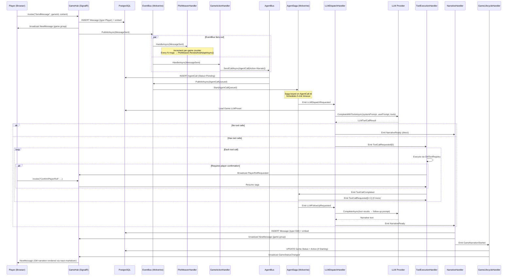
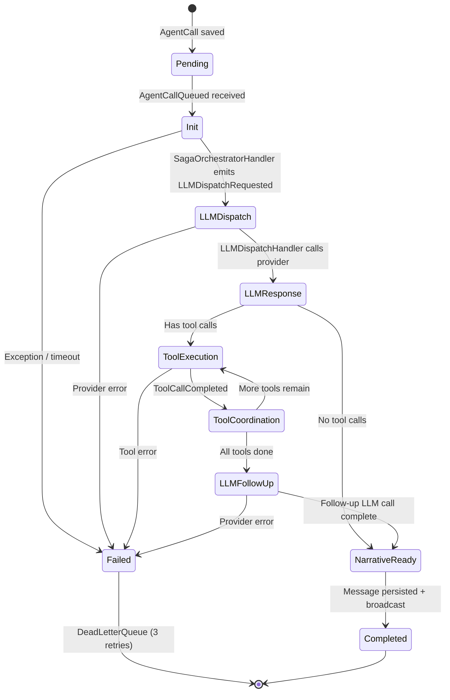
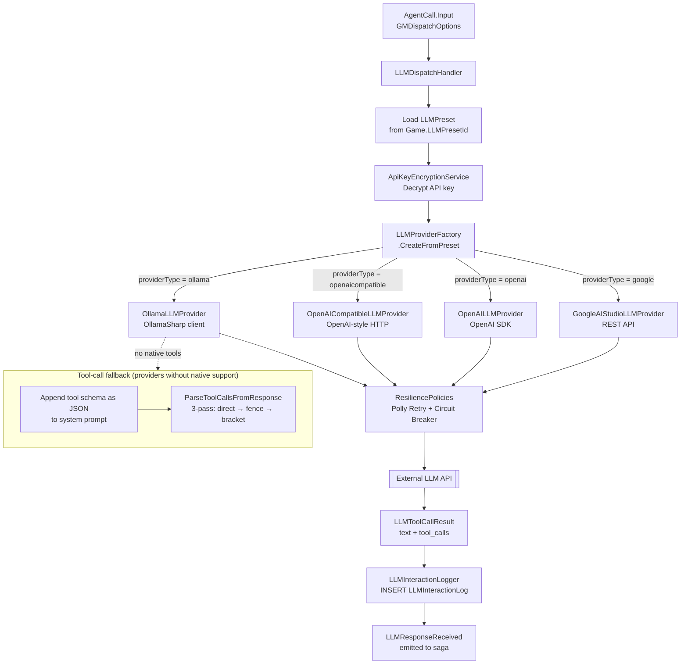
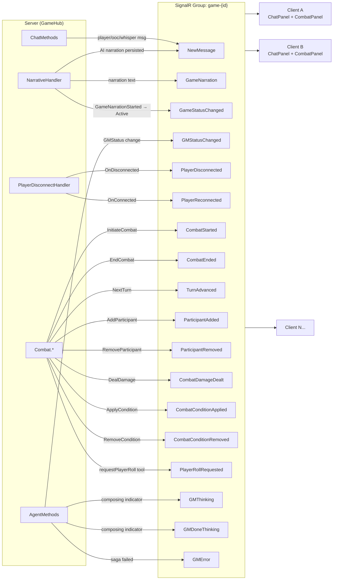
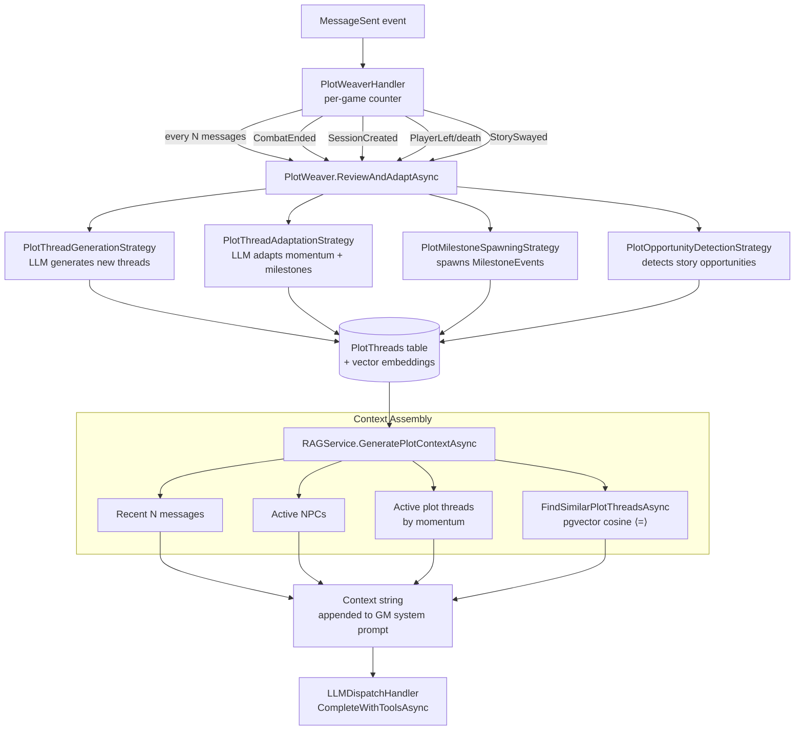
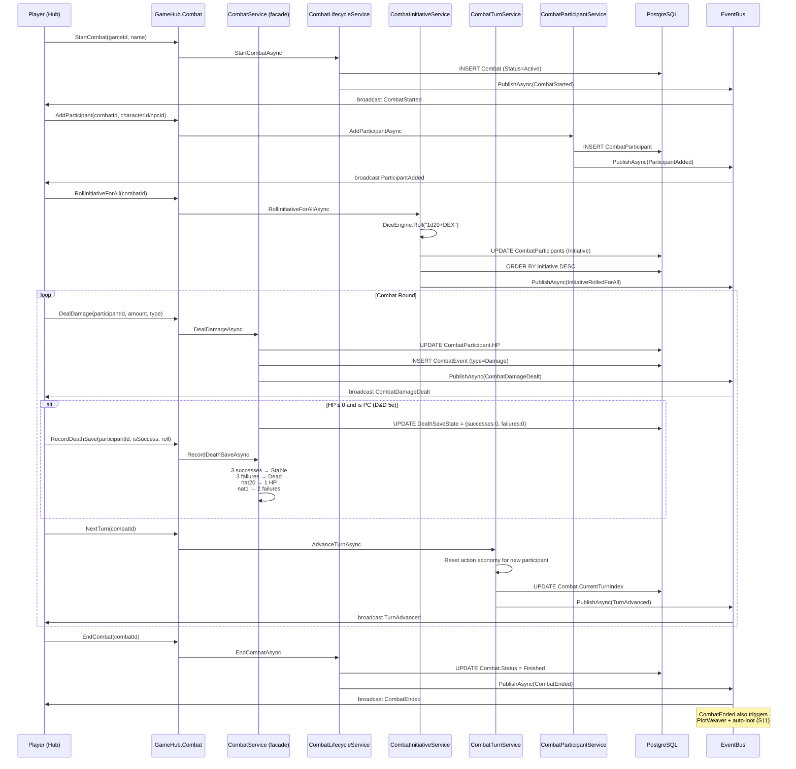
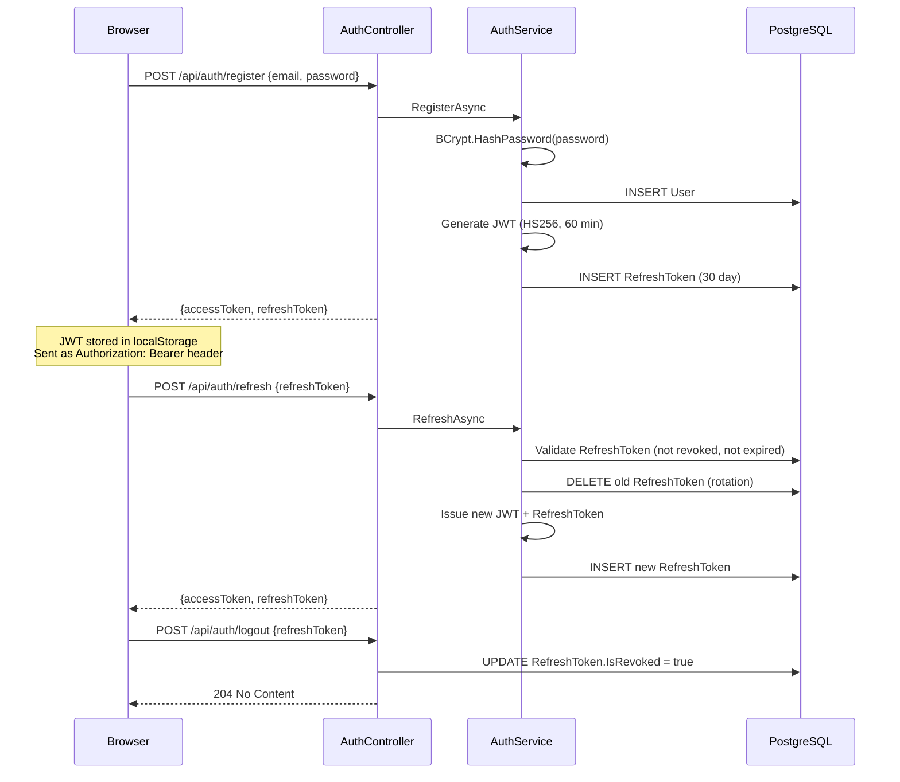

# ADnD — Event & LLM Interaction Flow Diagrams

> All diagrams use [Mermaid](https://mermaid.js.org/) syntax.

---

## 1. Full Player-Message → GM-Response Flow

The canonical game loop — from a player typing a message to the AI GM's narration appearing on every client.



---

## 2. Wolverine AgentSaga State Machine

The durable saga tracks each AI GM work unit from queued → completed.



---

## 3. LLM Provider Selection & Execution

How a raw `AgentCall` maps to an actual LLM API call.



---

## 4. SignalR Event Topology

All real-time events the server broadcasts to connected clients.



---

## 5. PlotWeaver & RAG Context Flow

How plot intelligence feeds the GM's context window.



---

## 6. Combat System Event Flow

Turn-by-turn combat lifecycle from hub to database.



---

## 7. Auth & Session Flow



---

## 8. Improvement Suggestions

These are architectural notes on gaps or enhancements worth considering as the remaining phases are built.

| # | Area | Current State | Suggestion |
|---|------|--------------|------------|
| I1 | **AgentSaga** | Wolverine saga class not yet implemented | `AgentSaga.cs` must be the first file added in Phase 6 gap-fill — the handlers reference saga state transitions but have no saga tracking them |
| I2 | **Strategy Layer** | `IAdndLlmStrategy` and 4 strategy classes referenced in design but missing from `Services/Llm/` | Add thin strategy classes that format request bodies per-provider; keeps providers interchangeable |
| I3 | **GMThinking indicator** | Designed (S1) but no server emission yet | Emit `GMThinking` at saga `LLMDispatch` step and `GMDoneThinking` at `NarrativeReady`; trivial addition |
| I4 | **Rate limiting** | CORS + auth wired, but `AddRateLimiter` not registered | Add `builder.Services.AddRateLimiter(...)` in Program.cs during Phase 9 polish |
| I5 | **Frontend** | Only `App.tsx` + `main.tsx` scaffolded | Phase 8 is the largest remaining chunk; recommend spawning a dedicated UI agent with full design context |
| I6 | **Missing controllers** | ~12 controllers from Phase 5 list absent | Build alongside Phase 6/7 services as they become available (LLMLogsController requires Phase 7 RAGService, etc.) |
| I7 | **Hangfire** | Listed in Phase 7 but not in `Program.cs` yet | Add `Hangfire.AspNetCore` + `Hangfire.PostgreSql` registration; PlotWeaver scheduled jobs land here |
| I8 | **Context trim** | `MaxContextMessages`/`MaxContextTokenEstimate` on LLMPreset designed (S5) | Hook into `AgentBus.HandleGMCall()` before building the system prompt; simple slice of message list |
```
